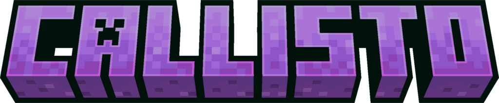

 <!-- SVG version -->
 <!-- SVG version -->

-------------
<h2>
  
  What does Callisto provide?
</h2>

### Currently:
- This adds a few providers and extra class that we will use in all our mods, this Library will save us the effort of coding the same things over and over for all our mods:

    * Datagen providers include; SoundsProvider, RecipeProvider.
    * Other stuff; DifferingHandModelItem.

### Cool Extras!
- This also adds a few "interactable" blocks, including;

    * Plush of me (Addie)

-------------
<h2>
    
    Adding new features
</h2>

**If you want new features in the library, you can either suggest them to me OR make a PR (pull request) detailing the feature in full!** 

-------------
<h2>
  
  How to use Callisto!
</h2>

### This is how you add the library to your mod: